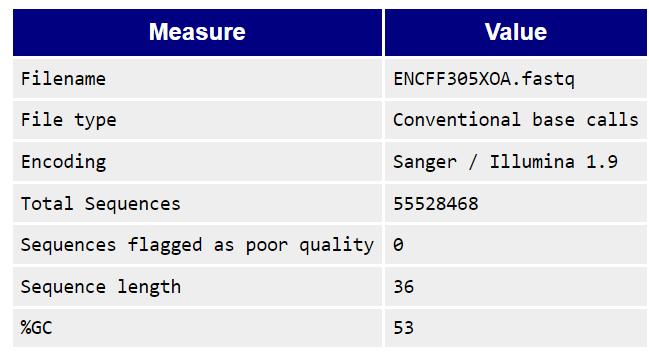
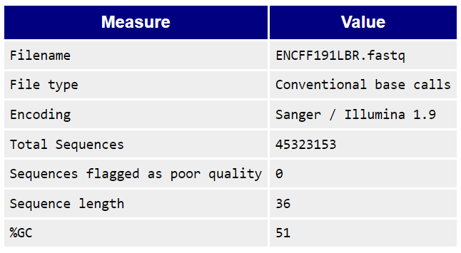
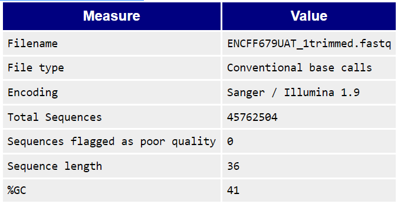

# hse_hw2_chip

Для исследования выбрана:
+ Клеточная линия: IMR-90
+ Гистоновая метка: H2AFZ

# Анализ FastQC

Все файлы представлены в папке [reports](./reports)

## Реплика 1 (ENCFF305XOA)
| |  |
|-----------------------|-------------------------|
|    |            |
|  Качество прочтений очень хорошее, все в зеленой зоне и даже не сильно падает к концу рида|          |
|    |             |

## Реплика 2 (ENCFF191LBR)
| |  |
|-----------------------|-------------------------|
|    |            |
|   |          |
|    |             |
## Контроль (ENCFF679UAT)
Потребовалось подрезание чтений
| |  |
|-----------------------|-------------------------|
|    |            |
|   |          |
|    |             |

#Таблица со статистикой по выравниванию на 14 хромосому

| ID | Всего ридов | Уникально выровнилось | Неуникально выравнилось | Не выравнилось |
|----|-------------|-----------------------|-------------------------|----------------|
| ENCFF305XOA   |  55528468   |  2109040 (3.80%)  |   7395246 (13.32%)  |  46024182 (82.88%)  |
| ENCFF191LBR   |  45323153   |  1891932 (4.17%)   |  8252847 (18.21%)   |   35178374 (77.62%)   |
| ENCFF679UAT   |  45762504   |  2087866 (4.56%)   |  6736644 (14.72%)   |   36937994 (80.72%)   |
